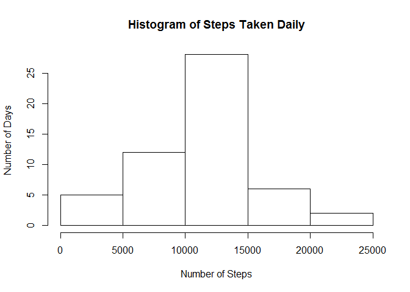
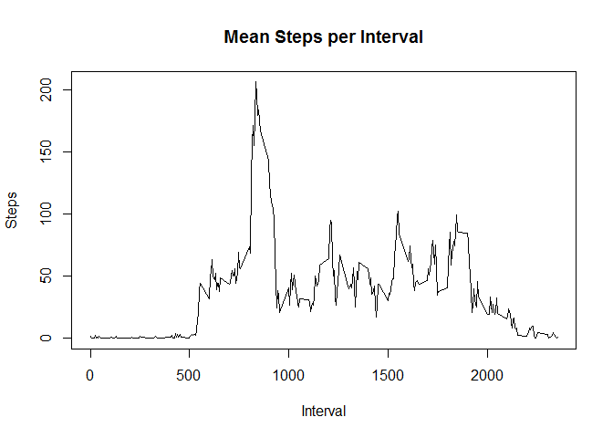
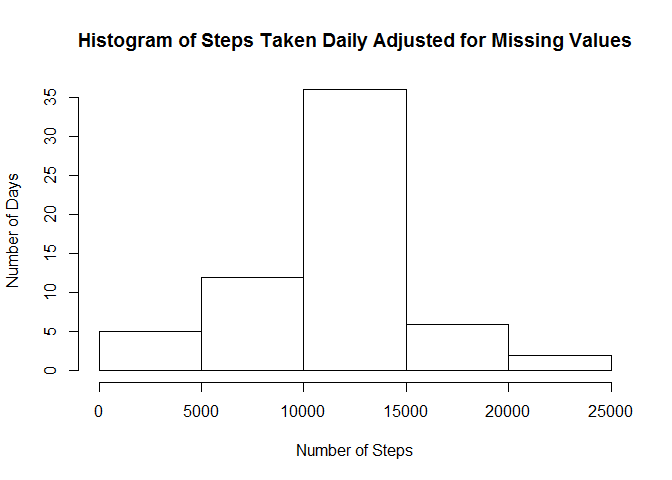
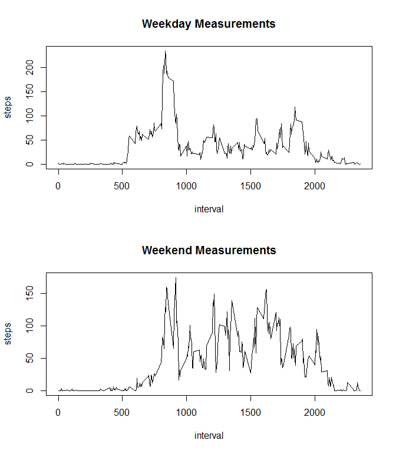

# Reproducible Research: Peer Assessment 1


## Loading and preprocessing the data


```r
## loading dplyr library may produce some warning messages. there is no way to suppress them
library(dplyr)
```

```
## 
## Attaching package: 'dplyr'
## 
## The following object is masked from 'package:stats':
## 
##     filter
## 
## The following objects are masked from 'package:base':
## 
##     intersect, setdiff, setequal, union
```

```r
activityData <- read.csv(".\\activity.csv")
summary(activityData)
```

## What is the mean total number of steps taken per day?

Use summarise to sum the number of steps by date, ignoring missing data:


```r
byDate <- group_by(activityData, date)
stepsByDate <- summarise(byDate, sumSteps=sum(steps, rm.na=TRUE))
```

Create a histogram of the number of steps taken 

```r
hist(stepsByDate$sumSteps, xlab="Number of Steps", ylab="Number of Days", main="Histogram of Steps Taken Daily")
```

 

Calculate the mean total steps taken per day:

```r
mean(stepsByDate$sumSteps, na.rm=TRUE)
```

```
## [1] 10767.19
```

Now calculate the median total steps taken per day:


```r
median(stepsByDate$sumSteps, na.rm=TRUE)
```

```
## [1] 10766
```
## What is the average daily activity pattern?

Summarise by interval, and plot the steps per interval averaged over the number of days in the study

```r
byInterval <- group_by(activityData, interval)
stepsByInterval <- summarise(byInterval, meanSteps=mean(steps, na.rm=TRUE))
plot(stepsByInterval$interval, stepsByInterval$meanSteps, type="l", xlab="Interval", ylab="Steps", main="Mean Steps per Interval")
```

 

## Imputing missing values

To compute the number of missing values, compute the sum of the inverse of complete.cases

```r
sum(!complete.cases(activityData))
```

```
## [1] 2304
```
To impute missing values, assume the mean for the interval when a value is missing.  To do this, we merge the original data set with the interval means calculated above, and create a new column "adjSteps" that will contain the actual value where it exists and the interval average where it does not.  

```r
mergedData <- merge(activityData, stepsByInterval, by="interval")
mergedData <- mutate(mergedData, adjSteps=ifelse(is.na(steps), as.integer(meanSteps+0.5), steps))
```

Create a histogram for the number of steps per day as above using the adjusted values for steps


```r
byDateAdj <- group_by(mergedData, date)
stepsByDateAdj <- summarise(byDateAdj, sumSteps=sum(adjSteps))
hist(stepsByDateAdj$sumSteps, xlab="Number of Steps", ylab="Number of Days", main="Histogram of Steps Taken Daily Adjusted for Missing Values")
```

 
  
The mode of the adjusted histogram is a bit higher because some days previously had 0 values, now have average values.  
  
Compute the mean and median of the adjusted data set:


```r
mean(stepsByDateAdj$sumSteps)
```

```
## [1] 10765.64
```

```r
median(stepsByDateAdj$sumSteps)
```

```
## [1] 10762
```

Both the mean and median are a little bit lower than in the unadjusted case.

## Are there differences in activity patterns between weekdays and weekends?

Append a dayType factor column to the original data with two levels, "weekend" and "weekday":


```r
activityData$dayType <- as.factor(ifelse(weekdays(as.Date(activityData$date)) %in% c("Saturday", "Sunday"), "weekend", "weekday"))
```

Summarize the average number of steps per interval for weekdays and weekends

```r
weekdayData <- activityData %>% filter(dayType=="weekday") %>% group_by(interval) %>% summarise(avgSteps=mean(steps, na.rm=TRUE))
weekendData <- activityData %>% filter(dayType=="weekend") %>% group_by(interval) %>% summarise(avgSteps=mean(steps, na.rm=TRUE))
```

Produce separate plots for weekends and weekdays.


```r
par(mfrow=c(2,1))
plot(weekdayData$interval, weekdayData$avgSteps, xlab="interval", ylab="steps", type="l", main="Weekday Measurements")
plot(weekendData$interval, weekendData$avgSteps, xlab="interval", ylab="steps", type="l", main="Weekend Measurements")
```

 
